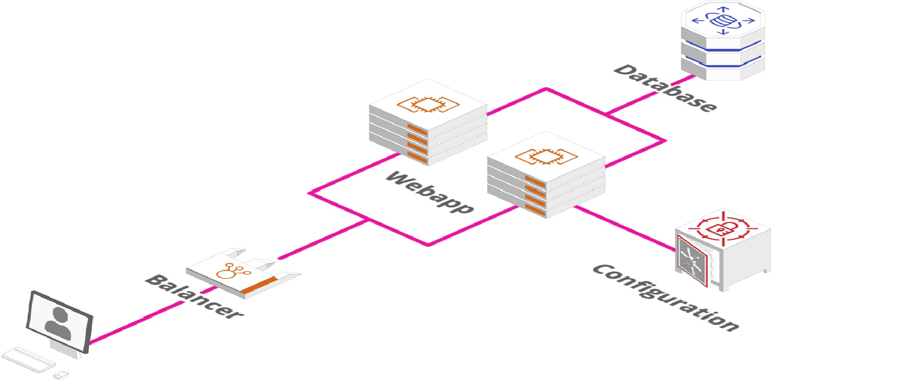

# AWS-practica-final
Simple project to deploy resources in AWS, which will create the schema seen in the image.

Basically it is a simple app called "remember the bread", the deployment consist of a load balancer to redirect the traffic to the servers (just the load balancer can communicate with the servers), the webapp servers are deployed in 2 different zones for high availability, these servers communicate with a DB (MySQL) which is configured through a Secrets Manager.

## How to runt it
Open a terminal and execute  terraform init

Then execute terraform plan

Finally execute terraform apply.

Open AWS console, login with the credentials and check the ALB dns, copy paste on your browser url bar and enjoy the app!

## Author ✒️
Jesus Fernandez Arroyo -(https://www.linkedin.com/in/jesus-fernandez-b3a969b0/)
